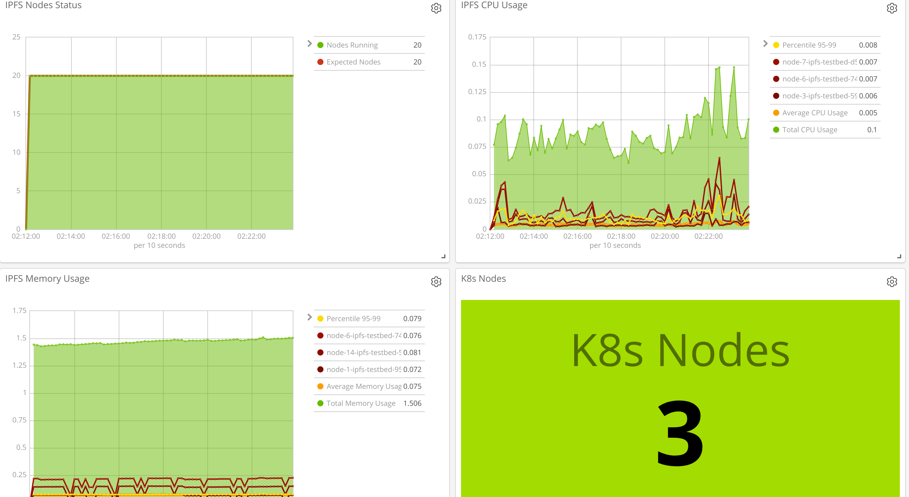
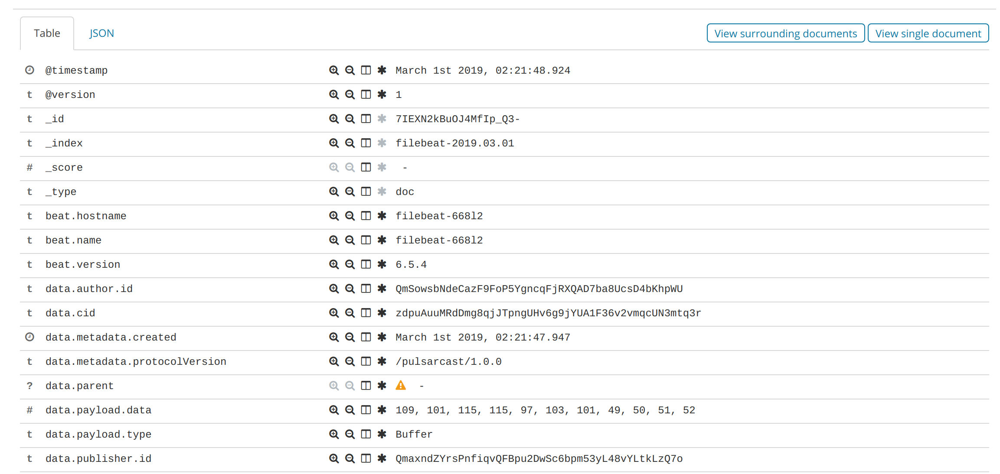

# JS IPFS Testbed

A testbed for [JS-IPFS](https://github.com/ipfs/js-ipfs) built using [Toxiproxy](https://github.com/shopify/toxiproxy) and [Kubernetes](kubernetes.io). It's designed to work locally in your Minkube setup or it can be deployed in any current K8s cluster you have and scale it up as much as you like.





## Goals

The purpose of this testbed is to run tests for my [M.Sc. Thesis project, Pulsarcast](https://github.com/JGAntunes/pulsarcast). What I was looking for initially was:

- Configure and deploy a large amount of IPFS nodes in an automated and predictable way
- Scale as much as our wallet can afford :money_with_wings::money_with_wings:
- Interaction with the nodes should:
  - Be simple and allow automation/scripts to be built on top of it
  - Allow to target commands to a specific node
  - Allow to target commands at a random node
- Allow to simulate network failures, latency and other relevant issues
- Continuously monitor and collect relevant data from the IPFS deployments and the resources used (network, disk, memory, CPU)

## How it works

### IPFS and Toxiproxy

We deploy using [Helm](https://helm.sh) and use a [specific chart](https://github.com/JGAntunes/helm-charts/tree/master/ipfs-testbed) that deploys in a single pod an IPFS node and a Toxiproxy container as a sidecar, through where all the libp2p-swarm communication flows. Each deployment exposes the IPFS HTTP API, the Toxiproxy HTTP API and the libp2p-swarm TCP port proxied by toxiproxy.

A service of type [`NodePort`](https://kubernetes.io/docs/concepts/services-networking/service/#publishing-services-service-types) is created for each deployment, exposing each IPFS Node in a random port at each K8s Node (in the future ingreses might be considered). This also makes each [IPFS node discoverable using the DNS records created by K8s for each service](https://kubernetes.io/docs/concepts/services-networking/service/#dns).

Readiness and liveness probes are configured by default, as well as the proxy setup for [libp2p-swarm default TCP port](https://github.com/ipfs/js-ipfs/blob/master/src/core/runtime/config-nodejs.js#L6).

You can fine tune the config of both Toxiproxy and IPFS, including even the docker images used, using the [available options at the Helm chart](https://github.com/JGAntunes/helm-charts/blob/master/ipfs-testbed/values.yaml).

### Test and interaction

The deployment described above gives you two HTTP APIs that allow you to run [toxics](https://github.com/shopify/toxiproxy#toxics) (network interferance) and IPFS commands at each node.

With this in mind we've build a CLI utility to cut down the burden of interacting with any specific node, running IPFS commands, or create/delete toxics.

### Monitoring and collecting data/results

The final component of the testbed is an ELK setup ([Elasticsearch](https://www.elastic.co/products/elasticsearch), [Logstash](https://www.elastic.co/products/logstash) and [Kibana](https://www.elastic.co/products/kibana)), also deployed in Kubernetes, used to monitor and collect data from your IPFS nodes. [Filebeat](https://www.elastic.co/products/beats/filebeat) and [Metricbeat](https://www.elastic.co/products/beats/metricbeat) are used to read the logs and metrics from your k8s cluster, forward these to logstash for processing which finally stores it in Elasticsearch. Kibana provides an UI from where you can query your data and build visualizations with it (some are already available in this repo, but you're of course free to add more).

## Requirements

In order to use and run everything in here you'll need:

- `kubernetes` cluster  `>=v1.9`
- `kubectl`
- `helm`
- `bash`
- `jq`
- `make`
- `nodejs` `>=8` in order to use the cli

**IMPORTANT**: both the CLI and the `Makefiles` will use your current kube context, so make sure to have the right cluster selected before jumping on this.

## Install

Clone the repo:

```
git clone git@github.com:JGAntunes/ipfs-testbed.git
```

All the Kubernetes setup we use is modularised and prepared to be installed using `make` so that you're free to setup and use what you feel fits your needs.

If you want to, you can deploy everything ofc.

Run thtough the sub dirs in `./kubernetes` and run `make` (except for `ipfs-testbed`, that will be the next and final deployment step)

Finally, deploy `ipfs-testbed` selecting the option that best suits you:

```
# Deploy 10 nodes, two of which will act as bootstrap nodes
# to which every other node will connect
NODE_NUMBER=10 BOOTSTRAP_NUMBER=2 make install_bootstraped

# Deploy 10 nodes, with each node connecting by default with
# the previous one
NODE_NUMBER=10 make install_linked
```

In order to use the CLI run npm install in the root dir:

```
npm install
```

## CLI Usage

Once installed, you can use the cli to interact with the testbed.

Check the [CLI Repo](https://github.com/JGAntunes/ipfs-testbed-cli) for more info.

## License
MIT
